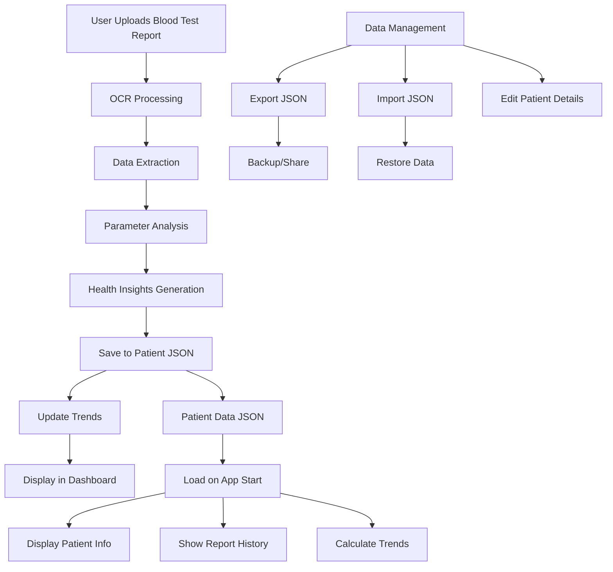
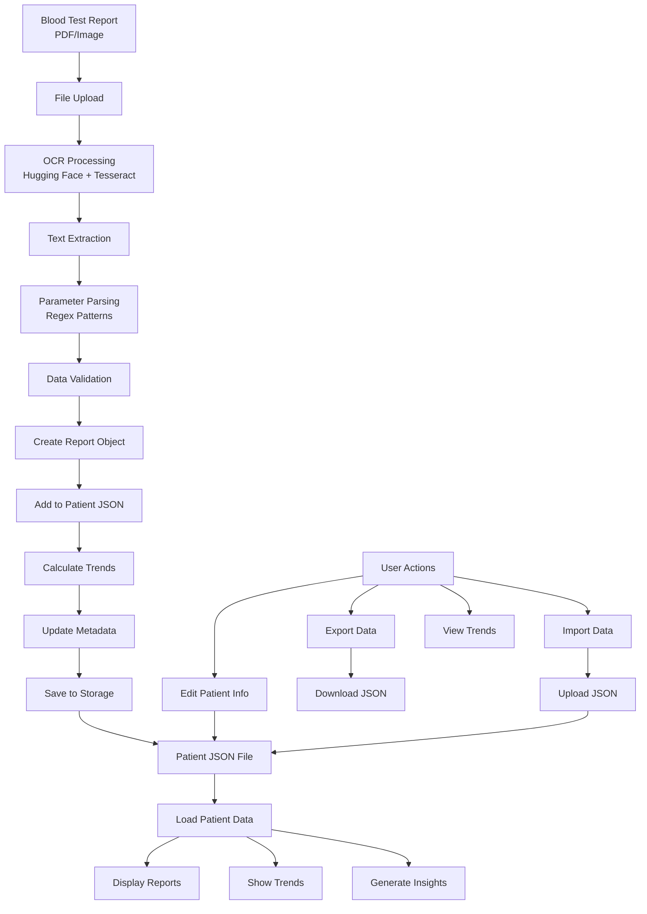
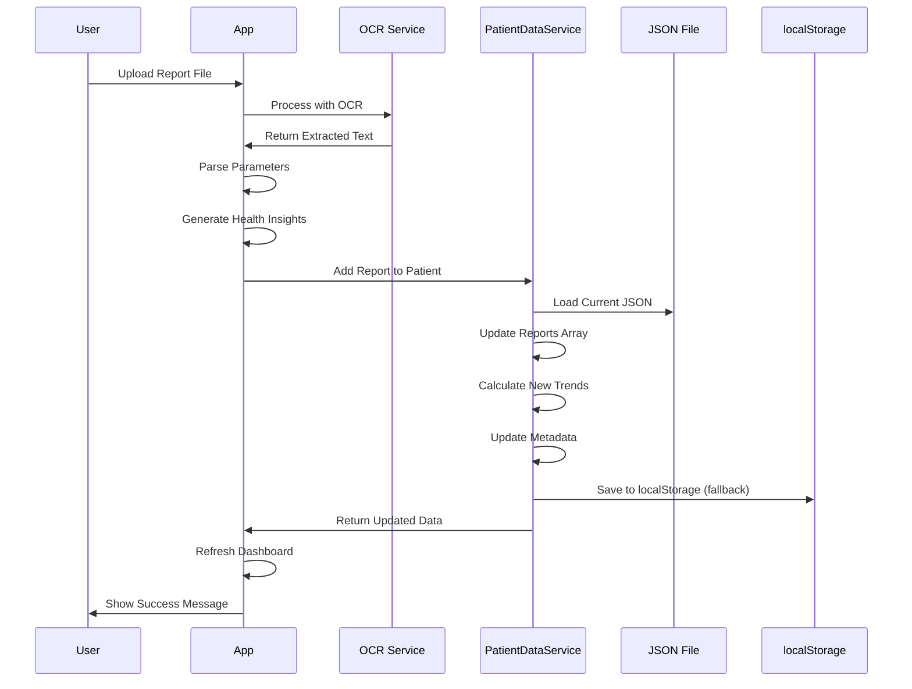
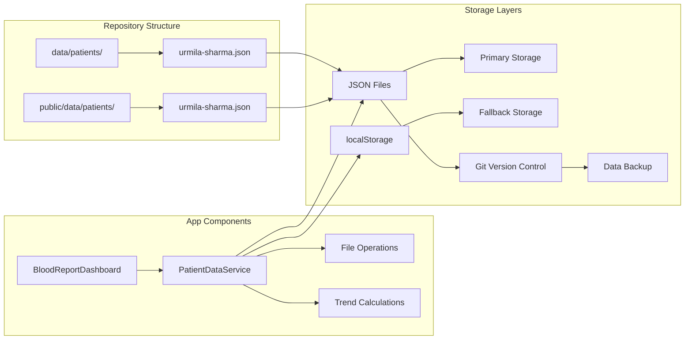
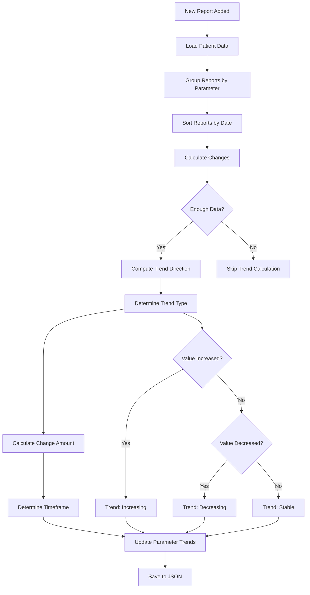
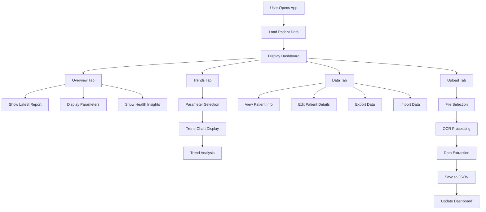
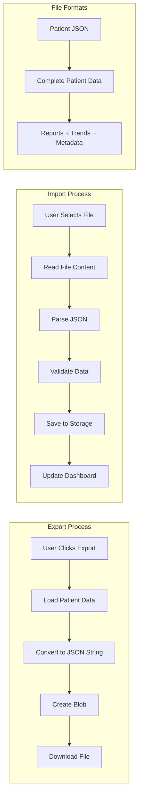
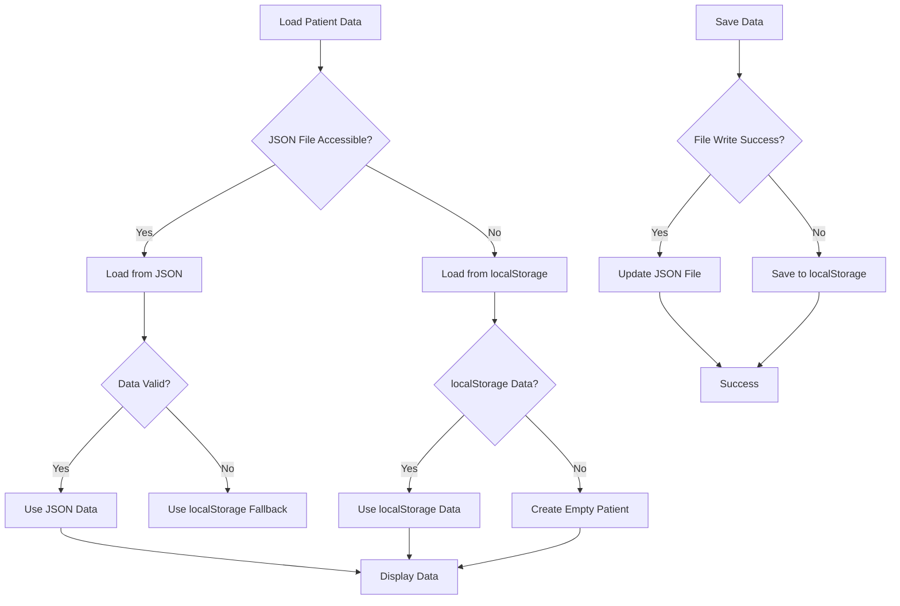

# Health Insight Tracker - Data Storage System

## Overview

The app now uses JSON files for data storage instead of localStorage. This provides better data persistence, easier backup/restore, and more professional data management.

## System Architecture Flow



## Data Flow Diagram



## Report Processing Flow



## Data Storage Architecture



## Trend Calculation Flow



## User Interaction Flow



## Data Export/Import Flow



## Error Handling & Fallbacks



## Data Structure

### File Location
- **Source**: `/data/patients/` (in repository)
- **Public**: `/public/data/patients/` (served by Vite)
- **Current Patient**: `urmila-sharma.json`

### JSON Schema
```json
{
  "patientId": "urmila-sharma",
  "name": "Urmila Sharma",
  "age": 52,
  "gender": "F",
  "relationship": "Mother",
  "reports": [
    {
      "id": "unique-report-id",
      "reportDate": "2024-01-15T08:30:00Z",
      "uploadDate": "2024-01-15T10:00:00Z",
      "type": "Blood Test",
      "fileName": "original-file-name.pdf",
      "patientName": "Urmila Sharma",
      "parameters": {
        "hemoglobin": {
          "value": 12.5,
          "unit": "g/dL",
          "normalRange": [12.0, 15.5],
          "status": "normal",
          "healthInsight": "Normal hemoglobin levels",
          "recommendation": "Continue current diet and lifestyle"
        }
      },
      "ocrRawText": "Full OCR output for debugging"
    }
  ],
  "trends": {
    "lastUpdated": "2024-01-15T10:00:00Z",
    "parameterTrends": {
      "hemoglobin": {
        "trend": "increasing",
        "lastValue": 12.5,
        "previousValue": 12.0,
        "change": "+0.5",
        "timeframe": "3 months",
        "lastReportDate": "2024-01-15T08:30:00Z"
      }
    }
  },
  "metadata": {
    "created": "2024-01-15T10:00:00Z",
    "lastModified": "2024-01-15T10:00:00Z",
    "totalReports": 1
  }
}
```

## How It Works

### 1. **Data Loading**
- App loads patient data from JSON files on startup
- Data is fetched from `/data/patients/{patientId}.json`
- Falls back to localStorage if JSON loading fails

### 2. **Data Saving**
- New reports are added to the JSON structure
- Trends are automatically calculated and updated
- Data is saved to localStorage (temporary fallback)
- **TODO**: Implement actual file writing when File System Access API is available

### 3. **Trend Calculation**
- Automatically calculates trends between consecutive reports
- Identifies increasing/decreasing/stable patterns
- Provides timeframe information (days, weeks, months, years)

## Usage

### **Upload Reports**
1. Go to the "Upload" tab
2. Select blood test report files (PDF/Images)
3. App extracts data using OCR
4. Data is automatically added to patient JSON
5. Trends are recalculated

### **View Data**
1. Go to the "Data" tab
2. View current patient information
3. Edit patient details if needed
4. Export data as JSON file
5. Import data from JSON file

### **View Trends**
1. Go to the "Trends" tab
2. Select parameter to analyze
3. View trend line chart
4. See trend direction and changes

## Data Management

### **Export Data**
- Click "Export" button in Data tab
- Downloads JSON file with current patient data
- Use for backup or sharing with healthcare providers

### **Import Data**
- Click "Import" button in Data tab
- Select JSON file to restore data
- Useful for data migration or recovery

### **Manual Editing**
- Click "Edit" button in Data tab
- Modify patient details, age, gender, relationship
- Save changes to update the data

## Git Integration

### **Commit Strategy**
- Commit JSON file after each new report
- Use meaningful commit messages: "Add blood test report from March 2024"
- Git history becomes a health timeline

### **Benefits**
- **Version Control**: Track changes over time
- **Data Recovery**: Easy rollback if needed
- **Collaboration**: Share data with other developers
- **Backup**: Git becomes your data backup system

## Future Enhancements

### **File System Access API**
- Direct file writing to user's device
- No more localStorage fallback
- True file-based storage

### **Multiple Patients**
- Support for multiple patient JSON files
- Patient selection and management
- Cross-patient analysis

### **Cloud Sync**
- Backup JSON files to cloud storage
- Cross-device synchronization
- Automatic backup scheduling

### **Data Validation**
- JSON schema validation
- Data integrity checks
- Error handling and recovery

## Troubleshooting

### **Data Not Loading**
- Check if JSON file exists in `/public/data/patients/`
- Verify file permissions and format
- Check browser console for errors

### **Reports Not Saving**
- App falls back to localStorage if JSON saving fails
- Check browser console for error messages
- Verify file structure and permissions

### **Trends Not Updating**
- Ensure at least 2 reports exist for trend calculation
- Check report dates are in correct format
- Verify parameter names match between reports

## File Locations

```
health-insight-track/
├── data/                          # Source data directory
│   └── patients/
│       └── urmila-sharma.json    # Patient data file
├── public/                        # Public assets (served by Vite)
│   └── data/
│       └── patients/
│           └── urmila-sharma.json # Public patient data
└── src/
    └── services/
        └── PatientDataService.ts  # Data management service
```

## Security Notes

- **Private Repository**: Ensure this is a private GitHub repository
- **Personal Data**: Contains actual health information
- **Access Control**: Only you should have access to the data
- **Backup**: Regularly export and backup your data

## Next Steps

1. **Test the new system** with your mom's actual reports
2. **Commit the initial JSON file** to start version control
3. **Upload a few reports** to see the system in action
4. **Explore the Data tab** to manage patient information
5. **Use the Trends tab** to analyze health patterns

The app is now ready to be a real family health tracking tool! 🏥✨
